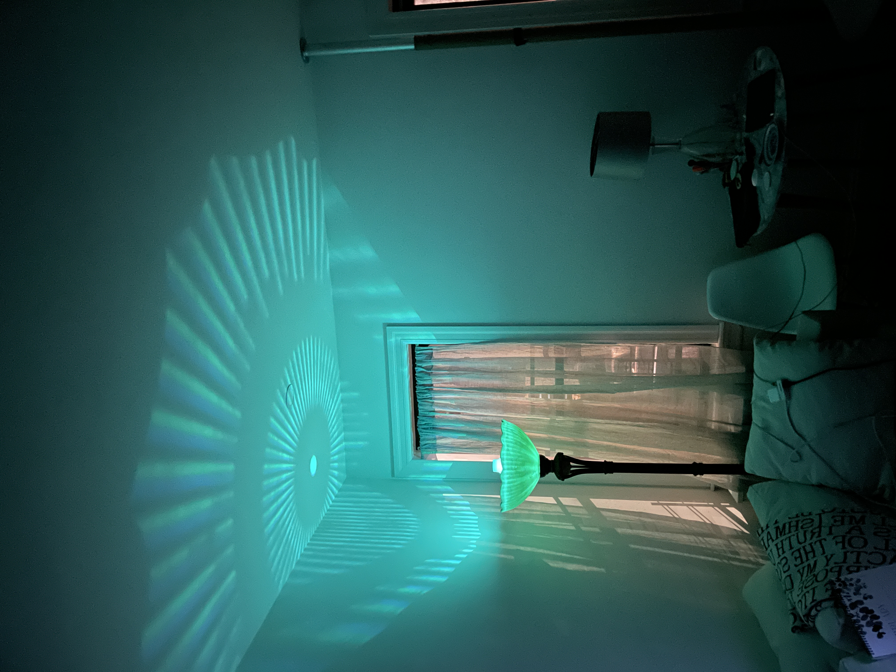

# Ethan Davey - Lamp Designer Portfolio

This is a portfolio website for lamp designer Ethan Davey, showcasing his creative journey, design exploration, and lamp creations under the studio name "Kaizen Glow".



## Features

- **Chronological Design Journey**: Visual narrative of the designer's progression
- **Responsive Design**: Optimized for all devices from mobile to desktop
- **Interactive Sections**: Engaging presentation of design process and materials
- **Image Lightbox**: Easy viewing of high-resolution design images
- **Contact Information**: Direct ways to connect with the designer

## Development

To run the development server:

```bash
npm run dev
```

The site will be available at http://localhost:3000 or via the Replit URL if using Replit.

## Building for Production

To build the static site for production:

```bash
node build-static.js
```

This will:
1. Generate all optimized assets in the `dist/public` directory
2. Show detailed deployment instructions
3. Create a production-ready version of the site

To test the production build locally:

```bash
node static-serve.js
```

## Deployment Options

### Option 1: Netlify (Recommended)

1. Create a Netlify account at [netlify.com](https://www.netlify.com/)
2. After building the site, drag and drop the `dist/public` folder into the Netlify dashboard
3. Configure redirect rules:
   - Create a `_redirects` file in the `dist/public` folder with: `/* /index.html 200`
   - Or use Netlify's GUI to add this redirect rule

### Option 2: Vercel

1. Push your code to a GitHub repository
2. Connect your repository to Vercel
3. Set the build command to `node build-static.js`
4. Set the output directory to `dist/public`
5. Configure rewrites to direct all paths to `index.html`

### Option 3: GitHub Pages (Detailed Instructions)

1. Build the static site:
   ```bash
   node build-static.js
   ```

2. Prepare your GitHub repository:
   - Create a new repository on GitHub (or use an existing one)
   - Make sure the repository name follows the pattern: `username.github.io` for a user site or any name for a project site

3. Copy these special GitHub Pages files to your repository root:
   - Copy `404.html` to your repository root
   - Copy the `.nojekyll` file (create it if it doesn't exist) to disable Jekyll processing

4. Deploy the built site:
   - Copy the contents of `dist/public` to your repository
   - Make sure `index.html` is at the root of your repository (for user sites) or in the root of your gh-pages branch (for project sites)

5. Configure repository settings:
   - Go to your repository settings on GitHub
   - Navigate to "Pages" in the left sidebar
   - Select the branch with your site files (usually `main` or `master`)
   - Make sure the folder is set to "/ (root)" or "/docs" depending on where you placed the files
   - Click "Save"
   
6. Wait for deployment:
   - GitHub will provide a URL like `username.github.io` or `username.github.io/repo-name`
   - It may take a few minutes for the site to be available

This specific configuration handles SPA routing properly on GitHub Pages, which otherwise would show 404 errors for direct page access.

### Option 4: Self-Hosting

For self-hosting on your own server:

1. Transfer the entire project to your server
2. Install Node.js if not already present
3. Run either:
   ```bash
   # To serve the pre-built files
   node static-serve.js
   
   # Or to build and then serve
   node build-static.js && node static-serve.js
   ```
4. For production use, consider using PM2 to keep the server running:
   ```bash
   npm install -g pm2
   pm2 start static-serve.js --name "ethan-portfolio"
   ```
5. Set up a reverse proxy with Nginx or Apache to serve on port 80/443

## Project Structure

- `client/` - Frontend React application
  - `src/` - Source code
    - `components/` - UI components including sections
    - `assets/` - Images and other static assets
    - `pages/` - Page components
- `server/` - Backend server for development
- `dist/public/` - Production-ready static files
- `static-serve.js` - Static file server
- `build-static.js` - Build script for production

## Contact

For questions about the portfolio site or to reach Ethan Davey:
- Email: kaizen.glow.lamp@gmail.com
- Instagram: @kaizen.glow
- Studio: Kaizen Glow, Brooklyn, NY